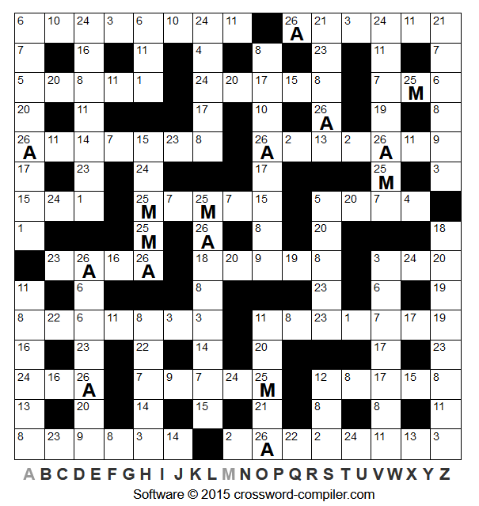

# CodeWord Solver

## Introduction

A CodeWord puzzle (sometimes called codebreaker) has a grid of overlapping words like a crossword but where the clues for what word to use comes from the pattern of letters within and between the words. An example of such a puzzle is shown below, from [Simple Daily Puzzles - May 16th](https://simplydailypuzzles.com/daily-codeword/).

This project is focussed on providing a program to algorithmically solve this kind of puzzle. This readme file provides details on the installation of the program and its usage including making puzzle files the program can read.

See the report document for details on the method behind the system.

## Installation

The program is written entirely in C and compiles using the Makefile provided.
Manual compilation can be used if using the Makefile is not an option. On Windows, the
additional flag `-l ws2_32` must be included to link networking libraries.

The following modules must be linked for each of the following executables:

| Executable | Modules Required |
| --- | --- |
| solver | puzzel, data, dataStore |
| makeData | (none) |
| patternFinderTest | data, dataStore |
| parserTest | puzzel, data |
| readTest | dataStore |

## Executables

The main executables that are needed are `solver` and `makeData` but three more are included which were used to test the system. Their use is optional.

### MakeData

`makeData` is responsible for processing the dictionary into a data-store that can be used by the program. Before running, ensure you have a directory called `data` and some dictionary file with words separated by new-line characters. Make sure the words are only alphabetic characters as numbers and other whitespace will be rejected.

It has the following usage: `./makeData <file_name> [test]` where `file_name` is the path to the dictionary file and the flag `test` can be inlcuded to output only to standard out without creating any new files.

It will create or overwrite the files `words` and `patternIndex` in the `data` directory.

### Solver

The main program to solve the codeword puzzles is in `solver`. It takes one argument: the file name of the puzzle to be solved. It will output the solution and optionally additional information to standard output.

Before compiling, there are a few options which can be used to alter its behaviour and output. The flags `DEBUG` and `VERBOSE` alter the output information. Without either set, the only information output will be the whether the puzzle was solved and the final mapping information. With `VERBOSE` set, there will be additional information about what decisions the program is making. The flag `DEBUG` is used to output much larger quantities of information to aid debugging. The last flag is the `TRACE_LIMIT` which will prevent excessive recursion when set. This is also used to aid debugging. Recompilation is required after changing any of these settings.

### Pattern Finding Test

The script `patternFinderTest` is a test program which will read the available dictionary and produce a list of all words that match a pattern the user provides.

When prompted, enter a word to define a pattern followed by a space and then a second word containing known letters. This must be the same length and have a '#' where the letter in that position is irrelevant and '&' when the letter must match the one given. There is a maximum length of 100 characters

An example is entering the string `quit &&&#` which represents the pattern `q u i ?`.

It would have been possible to implement the input to take something of the form `qui#` to do the same but this method was chosen as it allows duplicate unknown letters to be taken into account and provided a more natural method of entering patterns when starting with a known word and looking for others with similar patterns.

### Parser Test

This script (`parserTest`) will read in a file given by the first argument, parse this as a puzzle file and display the information read. This was used to test the puzzle file parser as well as checking the correctness of puzzle files.

### Read Test

The executable `readTest` is used for checking the integrity of the data store. It will read the entire store and write this in a readable format to standard output. Beware that this should only be used when the dictionary used is reasonably small as it will write considerable amounts of data to the output.

## Files

There are a few file formats which are important to the user. These are described in sufficient detail here.

### Puzzle Files

These are the most important file type to be aware of as they hold the puzzles that the program will attempt to solve. They are split into two sections: known letters followed by code-words.

In the known letters section, each decoded letter is displayed as the number being decoded followed by a space and then the decoded letter. Each letter takes up a new line. An example would be `"12 a\n20 b\n"` where `\n` represents the new line character.

The sections are separated by a blank line.

The code-words section holds one line for each code-word. Each word consists of the numbers which make up the code-word separated by spaces. Do not include the letters even when they are known. An example would be `"4 1 12 1\n4 16 16 13 12\n"`

No other whitespace can be included anywhere in the file.

Feel free to use `parserTest` to check the files you create.

### Dictionary (unprocessed)

A dictionary file can be any text-readable file (I recommend using `.txt` files in the `data` directory but this is not mandatory) consisting of any number of words separated by new-line characters. Only alphabetic characters can be used. No other characters of whitespace can be used.

An example of a full English dictionary in the public domain is available on [github - dwyl](https://github.com/dwyl/english-words/).

### Dictionary (processed)

This describes the files which are used by the system to search for words. These files (`data/words` and `data/patternIndex`) are made by the program `makeData` and should not be edited.

The `words` file holds the main list of words, all ASCII, no spacing.

The `patternIndex` file indexes the file `words`. The first four bytes of the file is number of patterns. Each pattern record starts with byte holding number of bytes in pattern. Following this is the pattern, using one byte for each pattern number. After this are four bytes holding the index of the start of the pattern in words: the byte number where the first word is. Finally, four bytes holding the number of words in the pattern.

An example pattern index record would be `0x06` (six characters in patter/each word) `0x00 0x01 0x02 0x01 0x02 0x01` (pattern is `0 1 2 1 2 1`) `0x00 0x0A 0x91 0x2E` (first character of first word with that pattern is at index 692526) `0x00 0x00 0x00 0xF1` (241 words belong to this pattern)

Note that all integers are stored in "network order" using `htonl` to convert them before storage.

